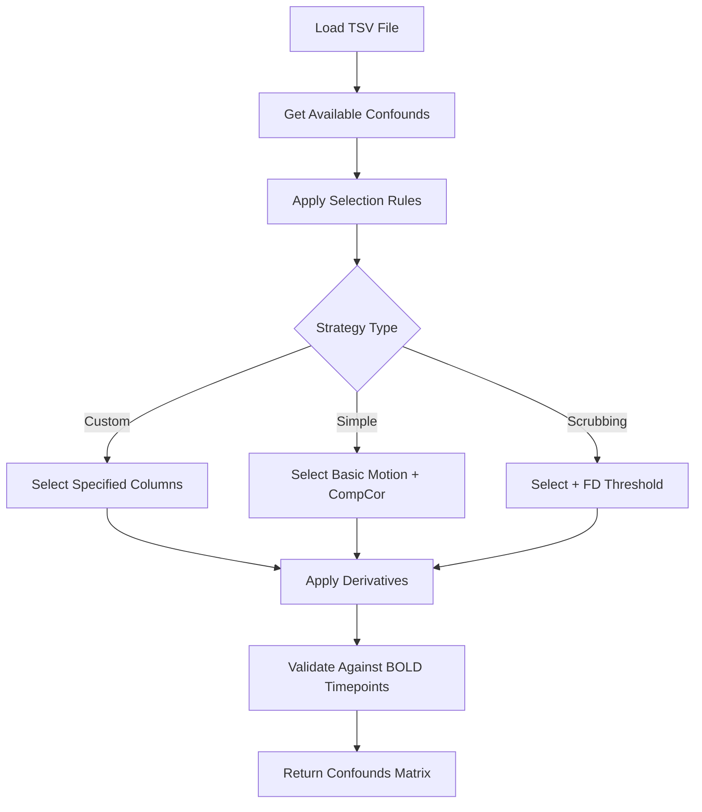
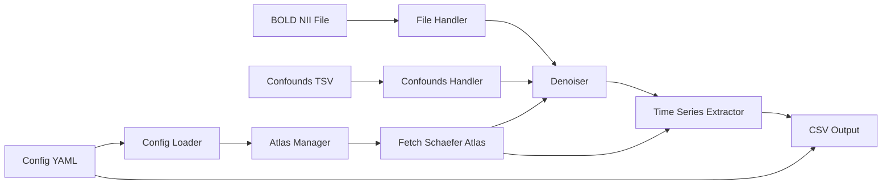

# Denoising Project Architecture

## Project Overview

This project provides a Python-based solution for denoising BOLD fMRI data and extracting time-series using nilearn. The system supports both CLI and Jupyter notebook usage, with all parameters configurable through YAML files.

---

## Directory Structure

```
Denoising/
├── denoising/                    # Main package directory
│   ├── __init__.py              # Package initialization
│   ├── config/                  # Configuration management
│   │   ├── __init__.py
│   │   ├── config_loader.py     # Load and validate configurations
│   │   └── schemas.py           # Pydantic/JSON schemas for validation
│   ├── core/                    # Core processing modules
│   │   ├── __init__.py
│   │   ├── atlas.py             # Atlas fetching and management
│   │   ├── denoiser.py          # Denoising operations
│   │   └── extractor.py         # Time-series extraction
│   ├── io/                      # Input/output handling
│   │   ├── __init__.py
│   │   ├── file_handler.py      # File I/O operations
│   │   └── confounds.py         # Confounds loading and selection
│   ├── cli/                     # Command-line interface
│   │   ├── __init__.py
│   │   └── main.py              # CLI entry point
│   └── utils/                   # Utility functions
│       ├── __init__.py
│       └── helpers.py           # Helper functions
├── configs/                     # Configuration files
│   ├── default_config.yaml      # Default parameters
│   └── atlas_config.yaml        # Atlas-specific configurations
├── notebooks/                   # Jupyter notebooks
│   └── example_usage.ipynb      # Usage examples
├── tests/                       # Test suite
│   ├── __init__.py
│   ├── test_config.py
│   ├── test_core.py
│   └── test_io.py
├── docs/                        # Documentation
│   └── README.md
├── pyproject.toml               # Project metadata and dependencies
├── requirements.txt             # Pinned dependencies
└── setup.py                     # Installation script
```

---

## Module Organization

### 1. Configuration Module (`denoising/config/`)

#### `config_loader.py`
- **Purpose**: Load and parse YAML configuration files
- **Key Functions**:
  - `load_config(config_path: str) -> dict`
  - `validate_config(config: dict) -> bool`
  - `merge_configs(*configs: dict) -> dict`

#### `schemas.py`
- **Purpose**: Define configuration schemas for validation
- **Key Classes**:
  - `AtlasConfig`: Atlas parameters (resolution, n_regions)
  - `DenoisingConfig`: Denoising parameters (smoothing, detrending)
  - `ConfoundsConfig`: Confounds selection rules
  - `PipelineConfig`: Complete pipeline configuration

### 2. Core Module (`denoising/core/`)

#### `atlas.py`
- **Purpose**: Handle atlas fetching and management
- **Key Class**: `AtlasManager`
  - `fetch_atlas(name: str, **params) -> NiftiLabelsMasker`
  - `get_region_names(atlas) -> List[str]`
  - `cache_atlas(atlas, cache_dir: str)`

#### `denoiser.py`
- **Purpose**: Apply denoising operations to fMRI data
- **Key Class**: `Denoiser`
  - `apply_smoothing(img: NiftiImage, fwhm: float) -> NiftiImage`
  - `apply_detrending(img: NiftiImage, **params) -> NiftiImage`
  - `apply_standardization(img: NiftiImage, **params) -> NiftiImage`

#### `extractor.py`
- **Purpose**: Extract time-series from denoised data
- **Key Class**: `TimeSeriesExtractor`
  - `extract_timeseries(bold_img: NiftiImage, atlas: NiftiLabelsMasker, confounds: np.ndarray) -> pd.DataFrame`
  - `save_timeseries(timeseries: pd.DataFrame, output_path: str)`

### 3. I/O Module (`denoising/io/`)

#### `file_handler.py`
- **Purpose**: Handle file operations for BOLD and output files
- **Key Functions**:
  - `load_bold_file(file_path: str) -> NiftiImage`
  - `save_output_file(data: pd.DataFrame, output_path: str)`
  - `parse_bids_filename(filename: str) -> dict`

#### `confounds.py`
- **Purpose**: Load and process confounds from TSV files
- **Key Class**: `ConfoundsHandler`
  - `load_confounds(tsv_path: str) -> pd.DataFrame`
  - `select_confounds(confounds_df: pd.DataFrame, selection_rules: List[str]) -> np.ndarray`
  - `get_available_confounds(tsv_path: str) -> List[str]`

### 4. CLI Module (`denoising/cli/`)

#### `main.py`
- **Purpose**: Command-line interface for pipeline execution
- **Key Functions**:
  - `parse_args() -> argparse.Namespace`
  - `run_pipeline(config_path: str, bold_path: str, confounds_path: str, output_dir: str)`
  - `main() -> None`

### 5. Utils Module (`denoising/utils/`)

#### `helpers.py`
- **Purpose**: Shared utility functions
- **Key Functions**:
  - `create_output_directory(path: str)`
  - `validate_file_exists(path: str)`
  - `log_progress(message: str)`

---

## Configuration File Format

### `configs/default_config.yaml`

```yaml
# Atlas Configuration
atlas:
  name: "schaefer_2018"
  resolution: 2  # mm
  n_regions: 400  # Number of brain regions
  
# Denoising Parameters
denoising:
  smoothing_fwhm: 6.0  # mm
  detrend: true
  standardize: "zscore"  # options: zscore, psc, false
  low_pass: 0.1  # Hz
  high_pass: 0.01  # Hz
  t_r: null  # Will be read from BOLD header if null
  
# Confounds Configuration
confounds:
  strategy: "custom"  # options: custom, simple, scrubbing
  columns:
    - "csf"
    - "white_matter"
    - "global_signal"
    - "trans_x"
    - "trans_y"
    - "trans_z"
    - "rot_x"
    - "rot_y"
    - "rot_z"
  derivatives:
    - "csf": ["power2"]
    - "white_matter": ["power2"]
  
# Output Configuration
output:
  directory: "./output"
  naming_pattern: "{subject}_{session}_{task}_{run}_atlas-{atlas_name}.csv"
  include_metadata: true
  
# Logging
logging:
  level: "INFO"  # DEBUG, INFO, WARNING, ERROR
  file: "./logs/denoising.log"
```

---

## Confounds Handling Strategy

### Confounds Selection Flow



### ConfoundsHandler Class Design

```python
class ConfoundsHandler:
    def __init__(self, config: ConfoundsConfig):
        self.config = config
        self.selection_rules = self._parse_selection_rules()
    
    def load_confounds(self, tsv_path: str) -> pd.DataFrame:
        """Load confounds from TSV file."""
        pass
    
    def select_confounds(self, confounds_df: pd.DataFrame) -> np.ndarray:
        """Select confounds based on configuration rules."""
        pass
    
    def _apply_derivatives(self, confounds_df: pd.DataFrame) -> pd.DataFrame:
        """Apply temporal derivatives to specified confounds."""
        pass
    
    def _validate_confounds(self, confounds: np.ndarray, n_timepoints: int):
        """Ensure confounds match BOLD timepoints."""
        pass
```

### Confounds Selection Rules

1. **Direct Column Selection**: Specify exact column names from TSV
2. **Pattern Matching**: Use regex patterns for column selection
3. **Derivative Generation**: Automatically create temporal derivatives
4. **Threshold-based Scrubbing**: Exclude volumes based on framewise displacement

---

## Main Classes and Functions

### Pipeline Orchestrator

```python
class DenoisingPipeline:
    """Main pipeline orchestrator for denoising and time-series extraction."""
    
    def __init__(self, config_path: str):
        self.config = load_config(config_path)
        self.atlas_manager = AtlasManager(self.config.atlas)
        self.denoiser = Denoiser(self.config.denoising)
        self.extractor = TimeSeriesExtractor()
        self.confounds_handler = ConfoundsHandler(self.config.confounds)
    
    def process_subject(self, bold_path: str, confounds_path: str, 
                        output_path: str) -> str:
        """Process a single subject's data."""
        pass
    
    def process_batch(self, subjects: List[dict]) -> List[str]:
        """Process multiple subjects."""
        pass
```

### Key Functions

| Module | Function | Purpose |
|--------|----------|---------|
| `config_loader` | `load_config()` | Load and validate YAML config |
| `atlas` | `fetch_atlas()` | Download and cache atlas |
| `denoiser` | `apply_smoothing()` | Spatial smoothing |
| `denoiser` | `apply_detrending()` | Remove linear trends |
| `denoiser` | `apply_standardization()` | Normalize time-series |
| `extractor` | `extract_timeseries()` | Extract ROI time-series |
| `extractor` | `save_timeseries()` | Save to CSV with region names |
| `confounds` | `select_confounds()` | Select confounds columns |
| `file_handler` | `parse_bids_filename()` | Extract BIDS entities |

---

## Dependencies

### `pyproject.toml`

```toml
[build-system]
requires = ["setuptools>=61.0", "wheel"]
build-backend = "setuptools.build_meta"

[project]
name = "fmri-denoising"
version = "0.1.0"
description = "BOLD fMRI denoising and time-series extraction using nilearn"
readme = "docs/README.md"
requires-python = ">=3.9"
authors = [
    {name = "Your Name", email = "your.email@example.com"}
]
dependencies = [
    "nilearn>=0.10.0",
    "numpy>=1.23.0",
    "pandas>=1.5.0",
    "pyyaml>=6.0",
    "pydantic>=2.0.0",
    "nibabel>=5.0.0",
    "scikit-learn>=1.2.0",
    "tqdm>=4.65.0",
]

[project.optional-dependencies]
dev = [
    "pytest>=7.0.0",
    "pytest-cov>=4.0.0",
    "black>=23.0.0",
    "flake8>=6.0.0",
    "mypy>=1.0.0",
]
jupyter = [
    "jupyter>=1.0.0",
    "ipykernel>=6.0.0",
    "matplotlib>=3.7.0",
    "seaborn>=0.12.0",
]

[project.scripts]
fmri-denoise = "denoising.cli.main:main"

[tool.setuptools.packages.find]
where = ["."]
include = ["denoising*"]

[tool.black]
line-length = 100
target-version = ['py39']

[tool.pytest.ini_options]
testpaths = ["tests"]
python_files = "test_*.py"
```

### `requirements.txt`

```
nilearn>=0.10.0
numpy>=1.23.0
pandas>=1.5.0
pyyaml>=6.0
pydantic>=2.0.0
nibabel>=5.0.0
scikit-learn>=1.2.0
tqdm>=4.65.0
```

---

## Data Flow Architecture



---

## Usage Patterns

### CLI Usage

```bash
# Single subject
fmri-denoise \
    --config configs/default_config.yaml \
    --bold path/to/bold.nii.gz \
    --confounds path/to/confounds.tsv \
    --output output_dir/

# Batch processing
fmri-denoise \
    --config configs/default_config.yaml \
    --subjects-list subjects_list.txt \
    --output output_dir/
```

### Jupyter Notebook Usage

```python
from denoising import DenoisingPipeline

# Initialize pipeline
pipeline = DenoisingPipeline(config_path="configs/default_config.yaml")

# Process single subject
output_file = pipeline.process_subject(
    bold_path="path/to/bold.nii.gz",
    confounds_path="path/to/confounds.tsv",
    output_path="output_dir/"
)

# Access results
import pandas as pd
timeseries = pd.read_csv(output_file)
```

---

## Error Handling Strategy

1. **Configuration Validation**: Validate all configs at load time
2. **File Existence Checks**: Verify input files before processing
3. **Shape Validation**: Ensure confounds match BOLD timepoints
4. **Atlas Caching**: Handle network failures gracefully
5. **Output Directory Creation**: Auto-create output directories
6. **Logging**: Comprehensive logging at all stages

---

## Testing Strategy

1. **Unit Tests**: Test individual functions and classes
2. **Integration Tests**: Test complete pipeline with sample data
3. **Config Tests**: Validate configuration schemas
4. **Mock Tests**: Mock atlas downloads for CI/CD

---

## Future Extensions

1. Support for additional atlases (Harvard-Oxford, AAL, etc.)
2. Parallel processing for batch operations
3. Quality control metrics generation
4. Visualization utilities
5. Support for surface-based analyses