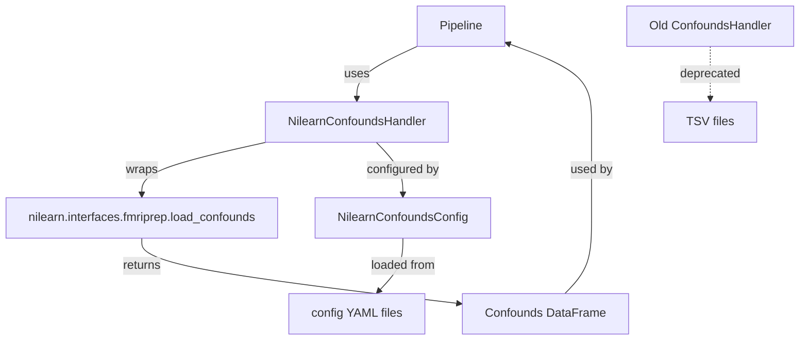

# Nilearn Confounds Handler Migration Plan

## Overview

Replace the current custom `ConfoundsHandler` with a new handler that wraps `nilearn.interfaces.fmriprep.load_confounds`. This will provide a more robust, standardized approach to confounds loading with all nilearn's parameters configurable via YAML.

## Current State Analysis

### Existing Implementation
- **File**: `denoising/io/confounds.py`
- **Class**: `ConfoundsHandler`
- **Method**: `load_and_select(tsv_path, demean, n_timepoints)`
- **Config**: Uses `ConfoundsConfig` with strategy (custom/simple/scrubbing), columns list, and fd_threshold

### Nilearn load_confounds Parameters
Based on test usage in `tests/test_io.py`:
```python
strategy_4 = {
    'strategy': ['motion', 'compcor', 'high_pass', 'global_signal'],
    'motion': 'full',
    'compcor': 'anat_combined',
    'n_compcor': 10,
    'global_signal': 'full',
}
```

## Implementation Plan

### 1. Create New Confounds Handler

**File**: `denoising/io/nilearn_confounds.py`

```python
"""Nilearn-based confounds loading using load_confounds."""

import logging
from typing import Dict, Any, Optional

import pandas as pd
from nilearn.interfaces.fmriprep import load_confounds

from denoising.config.schemas import NilearnConfoundsConfig

logger = logging.getLogger(__name__)


class NilearnConfoundsHandler:
    """Handle confounds loading using nilearn's load_confounds."""

    def __init__(self, config: NilearnConfoundsConfig):
        """Initialize with nilearn confounds configuration.

        Args:
            config: Nilearn confounds configuration.
        """
        self.config = config

    def load_and_select(self, bold_path: str) -> pd.DataFrame:
        """Load and select confounds using nilearn's load_confounds.

        Args:
            bold_path: Path to BOLD NIfTI file.

        Returns:
            DataFrame with selected confounds.
        """
        params = self._config_to_params()

        logger.info(f"Loading confounds for {bold_path}")
        logger.debug(f"Parameters: {params}")

        confounds_df, sample_mask = load_confounds(bold_path, **params)

        logger.info(f"Loaded {len(confounds_df.columns)} confounds")
        return confounds_df

    def _config_to_params(self) -> Dict[str, Any]:
        """Convert config object to params dict for load_confounds.

        Returns:
            Dictionary of parameters for nilearn's load_confounds.
        """
        params = {
            'strategy': self.config.strategy,
        }

        # Add optional parameters only if they are set
        if self.config.motion is not None:
            params['motion'] = self.config.motion
        if self.config.compcor is not None:
            params['compcor'] = self.config.compcor
        if self.config.n_compcor is not None:
            params['n_compcor'] = self.config.n_compcor
        if self.config.global_signal is not None:
            params['global_signal'] = self.config.global_signal
        if self.config.high_pass is not None:
            params['high_pass'] = self.config.high_pass
        if self.config.low_pass is not None:
            params['low_pass'] = self.config.low_pass
        if self.config.cosine is not None:
            params['cosine'] = self.config.cosine
        if self.config.scrub is not None:
            params['scrub'] = self.config.scrub
        if self.config.fd_th is not None:
            params['fd_th'] = self.config.fd_th
        if self.config.dvars_th is not None:
            params['dvars_th'] = self.config.dvars_th
        if self.config.tr is not None:
            params['tr'] = self.config.tr
        if self.config.include is not None:
            params['include'] = self.config.include
        if self.config.exclude is not None:
            params['exclude'] = self.config.exclude

        return params
```

### 2. Update Config Schema

**File**: `denoising/config/schemas.py`

Replace `ConfoundsConfig` with `NilearnConfoundsConfig`:

```python
class NilearnConfoundsConfig(BaseModel):
    """Nilearn load_confounds configuration parameters."""

    # Core parameters
    strategy: List[str] = Field(
        default_factory=lambda: ["motion", "compcor"],
        description="List of confound strategies to use"
    )

    # Motion parameters
    motion: Optional[str] = Field(
        default="basic",
        description="Motion parameters: basic, derivatives, power2, full"
    )

    # CompCor parameters
    compcor: Optional[str] = Field(
        default=None,
        description="CompCor strategy: anat_combined, anat_separated, temp_combined, temp_separated"
    )
    n_compcor: Optional[int] = Field(
        default=None,
        description="Number of CompCor components to use"
    )

    # Global signal parameters
    global_signal: Optional[str] = Field(
        default=None,
        description="Global signal: basic, derivatives, power2, full"
    )

    # Filter parameters
    high_pass: Optional[float] = Field(
        default=None,
        description="High pass filter cutoff in Hz"
    )
    low_pass: Optional[float] = Field(
        default=None,
        description="Low pass filter cutoff in Hz"
    )

    # Cosine regressors
    cosine: Optional[Union[int, str]] = Field(
        default=None,
        description="Cosine regressors: number or 'full'"
    )

    # Scrubbing parameters
    scrub: Optional[int] = Field(
        default=None,
        description="Number of volumes to remove before/after high motion"
    )
    fd_th: Optional[float] = Field(
        default=None,
        description="Framewise displacement threshold"
    )
    dvars_th: Optional[float] = Field(
        default=None,
        description="DVARS threshold"
    )

    # Other parameters
    tr: Optional[float] = Field(
        default=None,
        description="Repetition time in seconds"
    )
    include: Optional[List[str]] = Field(
        default=None,
        description="List of specific confounds to include"
    )
    exclude: Optional[List[str]] = Field(
        default=None,
        description="List of confounds to exclude"
    )

    @field_validator("motion", "global_signal")
    @classmethod
    def validate_motion_options(cls, v: Optional[str]) -> Optional[str]:
        if v is not None and v not in ["basic", "derivatives", "power2", "full"]:
            raise ValueError("Must be basic, derivatives, power2, or full")
        return v

    @field_validator("compcor")
    @classmethod
    def validate_compcor_options(cls, v: Optional[str]) -> Optional[str]:
        if v is not None and v not in ["anat_combined", "anat_separated", "temp_combined", "temp_separated"]:
            raise ValueError("Must be anat_combined, anat_separated, temp_combined, or temp_separated")
        return v

    @field_validator("strategy")
    @classmethod
    def validate_strategy(cls, v: List[str]) -> List[str]:
        valid_strategies = ["motion", "compcor", "global_signal", "high_pass", "low_pass", "cosine", "scrub"]
        invalid = [s for s in v if s not in valid_strategies]
        if invalid:
            raise ValueError(f"Invalid strategies: {invalid}. Valid options: {valid_strategies}")
        return v
```

Also update `PipelineConfig` to use the new schema:

```python
class PipelineConfig(BaseModel):
    """Complete pipeline configuration."""

    atlas: AtlasConfig = Field(default_factory=AtlasConfig)
    denoising: DenoisingConfig = Field(default_factory=DenoisingConfig)
    confounds: NilearnConfoundsConfig = Field(default_factory=NilearnConfoundsConfig)
    output: OutputConfig = Field(default_factory=OutputConfig)
    logging: LoggingConfig = Field(default_factory=LoggingConfig)
```

### 3. Update Default Config

**File**: `configs/default_config.yaml`

```yaml
# Confounds Configuration using nilearn load_confounds
confounds:
  strategy: ["motion", "compcor"]
  motion: "basic"  # options: basic, derivatives, power2, full
  compcor: "anat_combined"  # options: anat_combined, anat_separated, temp_combined, temp_separated
  n_compcor: 5  # Number of CompCor components
  global_signal: null  # options: basic, derivatives, power2, full
  high_pass: null  # Hz
  low_pass: null  # Hz
  cosine: null  # number or "full"
  scrub: null  # Number of volumes to remove
  fd_th: null  # Framewise displacement threshold
  dvars_th: null  # DVARS threshold
  tr: null  # Repetition time in seconds
  include: null  # List of specific confounds to include
  exclude: null  # List of confounds to exclude
```

### 4. Update Strategy 4 Config

**File**: `configs/strategy_4.yaml`

```yaml
# Confounds Configuration using nilearn load_confounds - Strategy 4
confounds:
  strategy: ["motion", "compcor", "high_pass", "global_signal"]
  motion: "full"
  compcor: "anat_combined"
  n_compcor: 10
  global_signal: "full"
  high_pass: 0.01  # Hz
  low_pass: null  # Hz
  cosine: null
  scrub: null
  fd_th: null
  dvars_th: null
  tr: null
  include: null
  exclude: null
```

### 5. Update Pipeline

**File**: `denoising/core/pipeline.py`

Change import:
```python
from denoising.io.nilearn_confounds import NilearnConfoundsHandler
```

Update initialization:
```python
self.confounds_handler = NilearnConfoundsHandler(config.confounds)
```

Update confounds loading (note: uses bold_path instead of confounds_path):
```python
# Load and select confounds
confounds = self.confounds_handler.load_and_select(bold_path)
```

Also update the `process_subject` signature - confounds_path is no longer needed:

```python
def process_subject(
    self,
    bold_path: str,
    output_dir: Optional[str] = None,
) -> str:
    """Process a single subject's data.

    Args:
        bold_path: Path to BOLD NIfTI file.
        output_dir: Output directory (uses config default if None).

    Returns:
        Path to output CSV file.
    """
```

And update `process_batch` accordingly:
```python
def process_batch(
    self,
    subjects: List[dict],
    output_dir: Optional[str] = None,
) -> List[str]:
    """Process multiple subjects.

    Args:
        subjects: List of dicts with 'bold_path' key.
        output_dir: Output directory.

    Returns:
        List of output file paths.
    """
    results = []
    for i, subject in enumerate(subjects):
        logger.info(f"Processing subject {i+1}/{len(subjects)}")
        try:
            output = self.process_subject(
                subject["bold_path"],
                output_dir,
            )
            results.append(output)
        except Exception as e:
            logger.error(f"Failed to process {subject['bold_path']}: {e}")
            results.append(None)

    return results
```

### 6. Update Module Exports

**File**: `denoising/io/__init__.py`

```python
from denoising.io.nilearn_confounds import NilearnConfoundsHandler
from denoising.io.confounds import ConfoundsHandler  # Keep for backward compatibility
from denoising.io.file_handler import parse_bids_filename

__all__ = [
    "NilearnConfoundsHandler",
    "ConfoundsHandler",  # Deprecated - kept for backward compatibility
    "parse_bids_filename",
]
```

### 7. Update Tests

**File**: `tests/test_io.py`

Update the test to use the new handler:

```python
def test_nilearn_confounds():
    """Test nilearn-based confounds loading."""
    config = load_config('/home/tm/projects/Denoising/configs/strategy_4.yaml')
    conf = NilearnConfoundsHandler(config.confounds)

    bold_path = r"/data/Projects/ABIDE2/ABIDEII-BNI_1/derivatives/sub-29006/ses-1/func/sub-29006_ses-1_task-rest_run-1_space-MNI152NLin2009cAsym_desc-preproc_bold.nii.gz"

    df_conf = conf.load_and_select(bold_path)

    # Validate no NaN values
    assert df_conf.isna().values.sum() == 0
    print(f"Loaded {len(df_conf.columns)} confounds")
```

## Architecture Diagram



## Key Changes Summary

| Component | Old | New |
|-----------|-----|-----|
| Handler | `ConfoundsHandler` | `NilearnConfoundsHandler` |
| Input | TSV file path | BOLD NIfTI file path |
| Config | `ConfoundsConfig` | `NilearnConfoundsConfig` |
| Parameters | strategy, columns, fd_threshold | All nilearn parameters |
| Backend | Custom pandas loading | nilearn.load_confounds |

## Migration Notes

1. **Breaking Change**: The `process_subject` method signature changes - `confounds_path` parameter is removed since nilearn's `load_confounds` derives the confounds path from the BOLD file path.

2. **Backward Compatibility**: The old `ConfoundsHandler` is kept in the codebase but not used by default.

3. **Configuration**: All existing YAML configs need to be updated to use the new parameter structure.

4. **Sample Mask**: The new handler returns a sample_mask from `load_confounds` but currently doesn't use it. This could be added in future for scrubbing support.